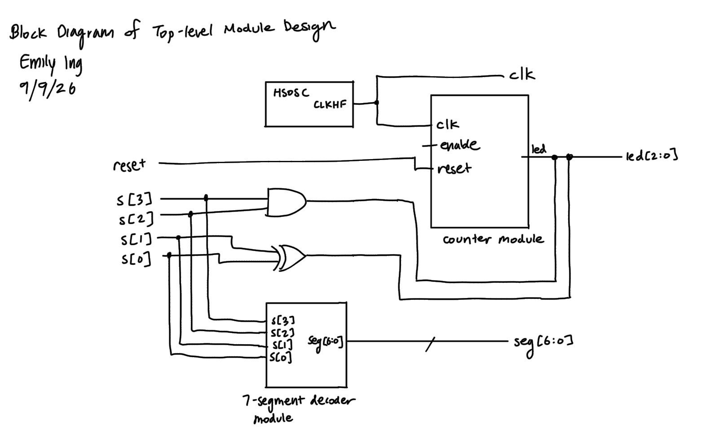
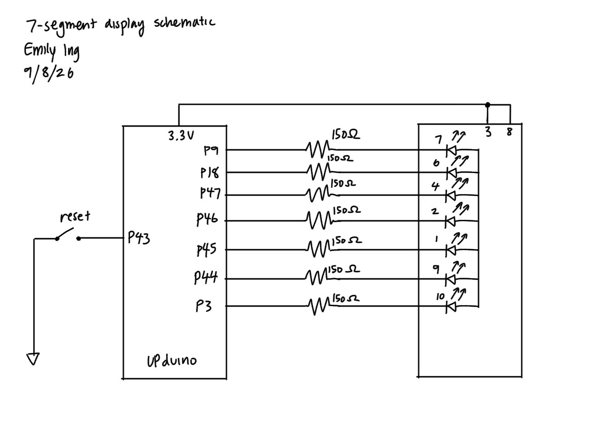
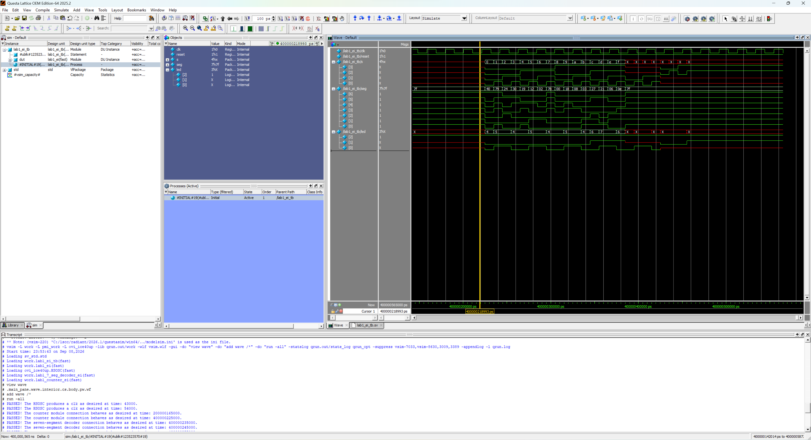
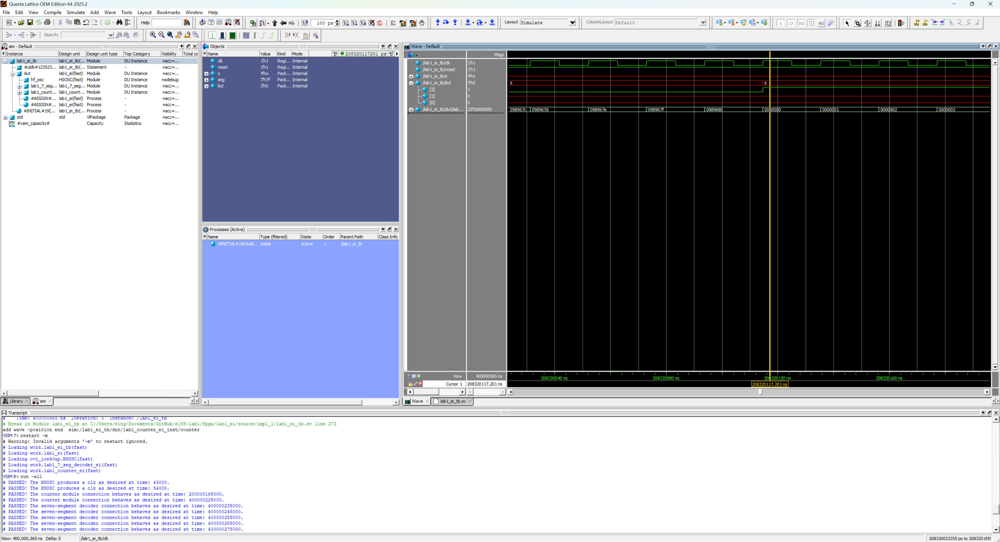
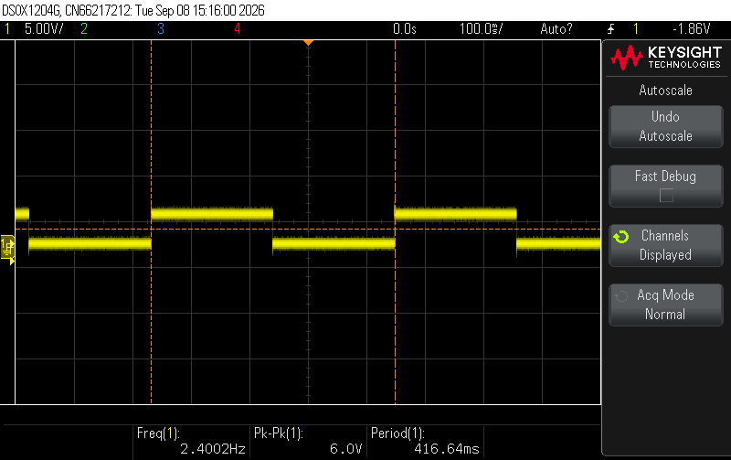
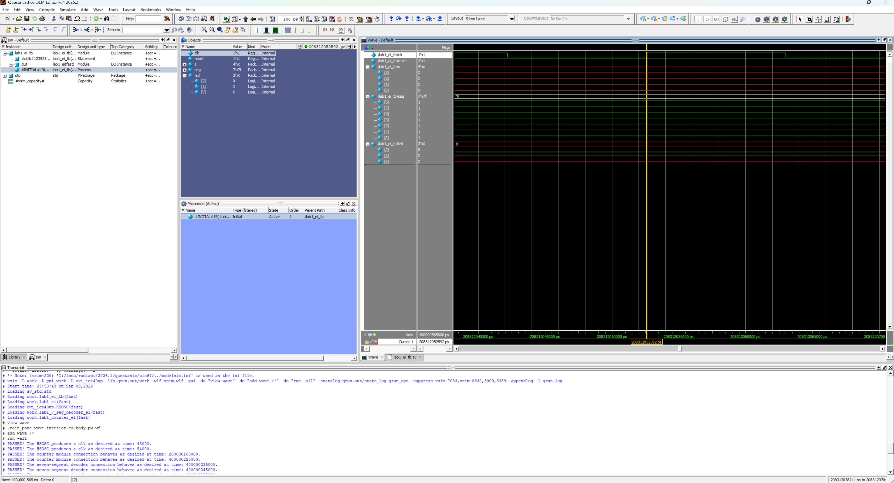
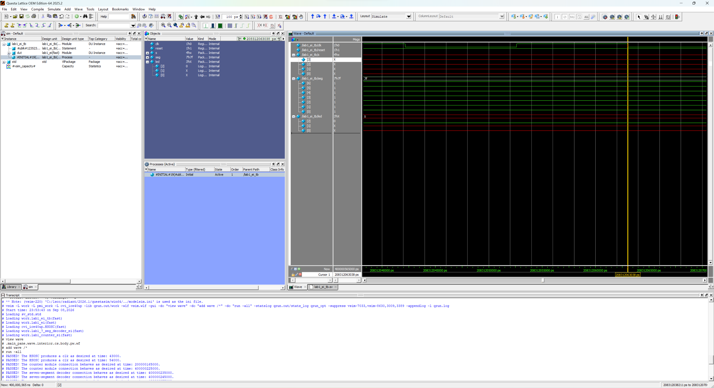
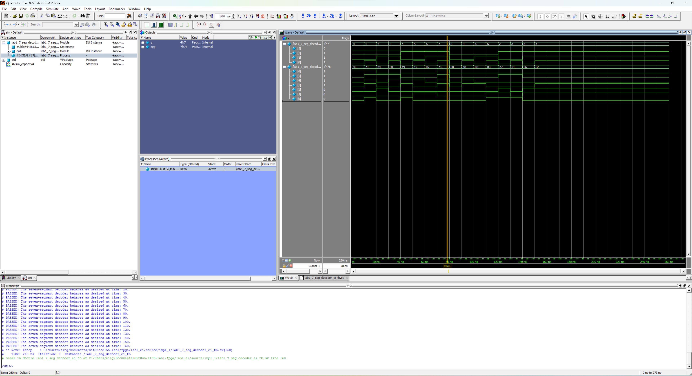
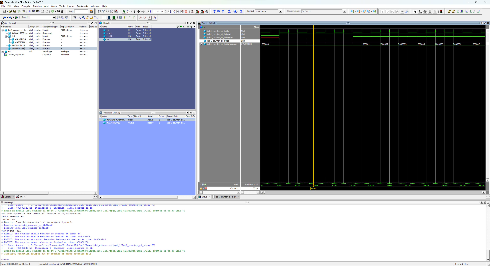
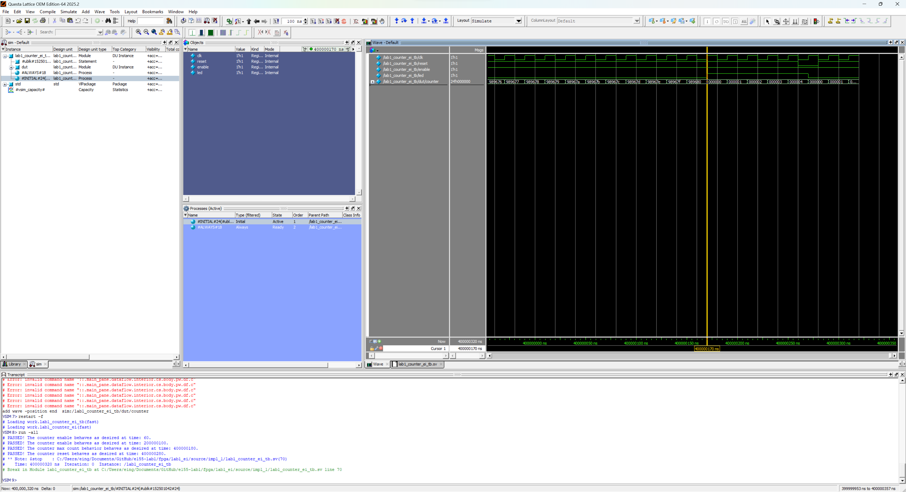

## Lab 1: FPGA and MCU Setup and Testing

### Introduction

This lab's first goal is to implement a design on the FPGA to blink an LED at 2.4 Hz using the HSOSC (onboard high-speed oscillator), which generates a 48 MHz clock.

The second goal is to implement a design that allows four switches (inputs) to control two LEDs (outputs) and a seven-segment display (outputs). The display aims to display all sixteen hexadecimal digits from 0x0 through 0xF.

### Design and Testing Methodology
I made 3 modules: a top module, counter module, and 7-segment display logic module to better organize the code.

#### Counter Module
First, I had to figure out how to blink the LED on and off at 2.4 Hz given the 48 MHz clock from the HSOSC. Using the following calculations, I got a maximum count that the counter is allowed to reach in order to achieve 2.4 Hz. The maximum count is used to determine when the LED will toggle on and off.

To achieve 2.4 Hz, the signal sent to the LED must be 4.8 Hz. This is because 2.4 Hz will only cover the period of time the LED will be blinking on (or off, depending on what you start with). Therefore, we calculate 48⁢𝑀⁢𝐻⁡𝑧/4.8⁢𝐻⁡𝑧 = 10,000,000 as the maximum value the counter can reach. 

In my always_ff block, to make the LED blink, I did led = ~led so that its state will change every time the code reaches that point.

#### 7-Segment Display Logic and Top Module
For the 7-segment display module, combinational logic is used to map switch inputs to outputs.

In the top module, I used combinational logic for the switch-to-LED functionality. I also used the top module as a way to instantiate the other modules.

#### Testing the Design
I used testbenches to test the design, which is explained in the Results and Discussion section.

### Technical Documentation

The source code for this lab can be found in [this GitHub repository](https://github.com/eing523/e155-lab1/tree/main).

#### Block Diagram

::: {.callout-note collapse="true"}
## Block Diagram

Figure 1: Block diagram of the top module design.
:::

The block diagram in [Figure 1](images/block_diagram.jpeg) demonstrates how the top module brings the counter and 7-segment display modules together. The top module also contains the switch-to-LED functionality.

#### Schematic

::: {.callout-note collapse="true"}
## Schematic

Figure 2: Schematic of the physical circuit (seven-segment display).
:::

The schematic in [Figure 2](images/schematic.jpeg) shows how the circuit is physically connected. To get the current-limiting resistor value of 150 $\Omega$, we use the equation from lecture:

$$
I_D=\frac{V_{DD}-V_{ON}}{R_S+R_D}
$$

We can assume $R_S$ to be negligible. From the datasheet, $V_{DD}$ = 3.3 V and $V_{ON}$ = 2.1 V. We will choose a current $I_D$ of 8 mA since it falls in the ideal range, according to the datasheet and lecture.

As a result, we get the resistor value of 150 $\Omega$.

### Results and Discussion

#### Testbench Simulation
##### Top Module Testbench Waveforms

::: {.callout-note collapse="true"}
## Testing Connection for 7-Segment Display Submodule and Switch-to-LED Functionality

Figure 3: Simulation waveforms for the top module 7-segment display connection and the switch-to-LED functionality.
:::
The waveforms in [Figure 3](images/topmoduletb_7seg_and_switchleds.png) show a successful testbench run. The testbench covers all 16 switch input combinations and their expected outputs for the 7-segment display, showing that the connection is working. This is the same for the switch-to-LED logic. Based on the messages in the transcript and the waveforms, the simulation results are consistent with the expected behavior, passing all test cases.

::: {.callout-note collapse="true"}
## Testing Connection/Assign 1 Liner for Counter Submodule

Figure 4: Simulation waveforms for the top module counter submodule connection and assign 1 liner functionality.

Figure 5: Oscilloscope output for the blinker functionality, reading 2.4 Hz.

:::
The waveforms in [Figure 4](images/topmoduletb_blinker.png) show a successful testbench run. We see that led[2], the LED that blinks, turns on when the counter reaches 10,000,000 (which is determined by desired frequency of 2.4 Hz). This means the assign 1 liner functionality and connection to the counter submodule is working. To further prove that the LED is blinking at 2.4 Hz, the oscilloscope output in [Figure 5](images/scope_2.png) confirms the frequency. Based on the messages in the transcript and the waveforms, the simulation results are consistent with the expected behavior, passing all test cases.

::: {.callout-note collapse="true"}
## Testing the HSOSC

Figure 6: Simulation waveforms for the HSOSC, cursor at 208312052592 ps.

Figure 7: Simulation waveforms for the HSOSC, cursor at 208312063038 ps.

:::
To confirm the HSOSC is working, we can calculate the difference between the selected times in [Figure 6](images/topmoduletb_clk1.png) and [Figure 7](images/topmoduletb_clk2.png). This difference represents the length of time that one high signal takes to complete. From the difference, we get 10446 ps, which is 10.446 ns. Since we know this, we know that a period takes 20.892 ns, which is equal to a frequency of about 47.87 MHz. This is very close to the expected 48 MHz, so we can conclude that the HSOSC is working as intended.

##### 7-Segment Display Submodule Testbench Waveforms

::: {.callout-note collapse="true"}
## Waveforms

Figure 8: Simulation waveforms for the 7-segment display submodule.
:::
The waveforms of the 7-segment display module are shown in [Figure 8](images/7segmoduletb.png). The testbench covers all 16 input combinations and their expected outputs. Based on the messages in the transcript and the waveforms, the simulation results are consistent with the expected behavior, passing all test cases.

##### Counter Module Testbench Waveforms

::: {.callout-note collapse="true"}
## Testing Enable

Figure 9: Simulation waveforms for the counter module enable signal.
:::
The waveforms of the enable signal are shown in [Figure 9](images/countermoduletb_enable.png). The testbench shows that the enable signal does change from 0 to 1. When enable = 0, the counter is unchanging; it is remaining at 0, showing that it is working. The counter continues to remain unchanged until enable is turned back on. Based on the messages in the transcript and the waveforms, the simulation results are consistent with the expected behavior (a success).

::: {.callout-note collapse="true"}
## Testing Reset

Figure 10: Simulation waveforms for the counter module reset signal.
:::
The waveforms of the reset signal are shown in [Figure 10](images/countermoduletb_reset.png). The testbench shows the reset signal changing from 1 to 0 to 1. We see that when reset = 0, the counter is reset to 0. When reset = 1, the counter is incrementing. Based on the messages in the transcript and the waveforms, the simulation results are consistent with the expected behavior (a success).

::: {.callout-note collapse="true"}
## Testing Max Count Feature

Figure 11: Simulation waveforms for the counter module max count feature.
:::
The waveforms of the max count feature are shown in [Figure 11](images/countermoduletb_maxcount.png). We see that when the counter reaches its maximum value of 10,000,000, the counter succesfully resets to 0. Based on the messages in the transcript and the waveforms, the simulation results are consistent with the expected behavior (a success).

Overall, due to the success of all testbenches, I can confidently say that the code works as intended. This is further verified by the fact that the hardware testing works exactly as expected.

### Conclusion

Using SystemVerilog and Lattice Radiant, I was able to create code that successfully blinks an LED at 2.4 Hz using the HSOSC, allows LEDs to be toggled by switches, and allows the seven-segment display to show the required hexadecimals. The seven-segment display is also controlled by switches correctly.

The design meets all the requirements. Overall, the lab was a success!

I spent a total of 40 hours working on this lab.

### AI Prototype Summary

::: {.callout-note collapse="true"}
## Gemini (AI)'s Code
module top (
    output logic led
);

    // Internal clock signal
    logic clk;

    // Instantiate the Lattice iCE40 UltraPlus high-speed oscillator for Radiant (HSOSC)
    HSOSC #(
        .CLKHF_DIV("0b11") // Divide base 48 MHz by 8 to get 6 MHz
    ) hfosc_inst (
        .CLKHFPU(1'b1),    // Power up the oscillator
        .CLKHFEN(1'b1),    // Enable the clock output
        .CLKHF(clk)        // Route to our internal clk signal
    );

    // 21-bit counter initialized to zero
    // 21 bits are required to count up to 1,500,000
    logic [20:0] counter = '0; 
    
    // LED register initialized to zero
    logic led_reg = 1'b0;
    
    assign led = led_reg;

    always_ff @(posedge clk) begin
        // To get a 2 Hz blink rate (0.5 second period), the LED must toggle 
        // every 0.25 seconds. At 6 MHz, 0.25s is exactly 1,500,000 cycles.
        if (counter == 21'd1_499_999) begin
            counter <= '0;         
            led_reg <= ~led_reg;
        end else begin
            counter <= counter + 1'b1;
        end
    end

endmodule
:::

Using Gemini, I produced the code above. I think that the quality of the output is high because it is concise and well-structured. However, the above code was not generated on the first try, since there was an error upon synthesizing the initial code. The error was, "35901063	Error	../source/impl_1/lab1_ai_prototype_ei.sv(15): instantiating unknown module SB_HFOSC. VERI-1063	[lab1_ai_prototype_ei.sv:15]". Upon telling the AI this error, it was immediately able to figure out that the SB_HFOSC primitive name it used was not up-to-date for Lattice Radiant (SB_HFOSC is used in older Lattice iCEcube2). The AI was able to correct this mistake to HSOSC. When I put the code back into Lattice Radiant, the code was successfully synthesized. 