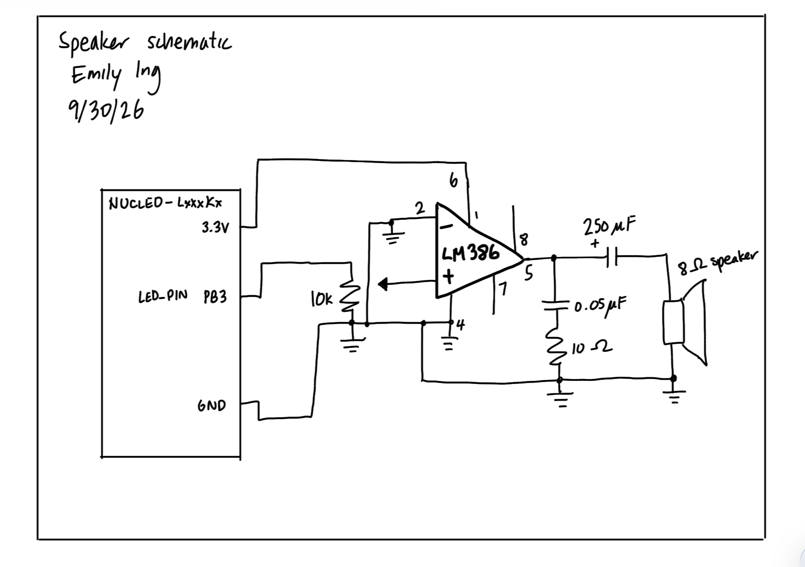

## Lab 4: Digital Audio

### Introduction

This lab aims to play Fur Elise and a chosen song from an 8 ohm speaker using an MCU and the SEGGER software. Timers 6 and 7 of the MCU are implemented in order to work with the duration and frequency of each note.

### Design and Testing Methodology
From the starter code, we are given a .c and .h file for FLASH, GPIO, and RCC (with me filling in the RCC .c file). the .c and .h files for TIM6 and TIM7 were written by me, where TIM6 works with the frequency and TIM7 works with the duration. A main.c file exists to play all notes of a specified melody.

#### Deriving calculations for durations and pitches: starter equations

This section will cover the equations I derived for all calculations, then I will use them in the following sections.

From the block diagram of TIM6/7, we see that for the PSC prescaler that we have an input of CK_PSC and an output of CK_CNT. Since the PSC prescaler acts as a divider, the following equation can be written:

$$
CK\_CNT = \frac{CK\_PSC}{PSC+1}
$$

Since we are passing the internal clock as unchanged, based on the block diagram, we can say that CK_PSC = CK_INT. (This is clarified since the code refers to CK_INT instead of CK_PSC.)

Next, we can look at the ARR and CNT counter section. We know that 1/CK_CNT gives the period, and that the CNT counter increments by 1 every CK_CNT tick. The CNT counter will count until it hits ARR, and then it wraps back to 0 (the update event). This would happen (ARR+1) times (so multiplying (ARR+1) by (1/CK_CNT)). This equation represents duration. Since the units of this are in terms of seconds, to derive an equation for frequency from this we can just take the reciprocal of the equation and get:

$$
frequency = \frac{CK\_CNT}{ARR+1}
$$

Substituting the equation for CK_CNT into frequency, we get

$$
frequency = \frac{CK\_PSC}{(PSC+1)(ARR+1)}
$$

We also know that frequency can be represented using the frequency of the note as:

$$
frequency = 2 * (f\_note)
$$

We'll let f_note = frequency of note.

Setting the two equations for frequency equal to each other, we can find ARR in terms of variables related to the block diagram of the timer. So we get:

$$
ARR = \frac{CK\_PSC}{2 * f\_note * (PSC+1)} - 1
$$

PSC = 0 for frequency calculations, so for that, this can be further simplified to:

$$
ARR = \frac{CK\_PSC}{2 * f\_note} - 1
$$

#### Minimum and Maximum Duration

The equation for duration is

$$
duration = \frac{ARR+1}{CK\_CNT}
$$

Substituting the equation for CK_CNT into the duration equation, we get:

$$
duration = \frac{ARR+1}{\frac{CK\_PSC}{PSC+1}} = \frac{(ARR+1)(PSC+1)}{CK\_PSC}
$$

For duration only, we will use PSC = 3999 in order to achieve a CK_CNT of

$$
CK\_CNT = \frac{CK\_PSC}{PSC+1} = \frac{4,000,000}{3999+1} = 1,000 \text{ Hz}
$$

Which allows us to get exactly 1 ms for period. It helps for easier calculation and timing of the durations.

##### Minimum duration

The minimum duration occurs when ARR is at its minimum value, which is 0. Substituting this into the duration equation gives a minimum duration of:

$$
duration = \frac{(0+1)(3999+1)}{4000000} = 0.001 \text{ s} = 1 \text{ ms}
$$

##### Maximum duration

The maximum duration occurs when ARR is at its maximum value, which is 2^(16) - 1. Substituting this into the duration equation gives a maximum duration of:

$$
duration = \frac{(2^{16}-1+1)(3999+1)}{4000000} = 65.536 \text{ s}
$$

#### Minimum and Maximum Frequency

Remember that setting the two equations for frequency results in

$$
2 * f\_note = \frac{CK\_PSC}{(PSC+1)(ARR+1)}
$$

$$
f\_note = \frac{CK\_PSC}{2(PSC+1)(ARR+1)}
$$

Also, remember that PSC = 0 for frequency calculations.

##### Minimum frequency
When we want less frequency, we get a higher counter maximum value. This means that ARR = 2^(16) - 1 (since it's 16 bits wide).

Substituting this in gives a minimum frequency of

$$
f\_note = \frac{4000000}{2(0+1)(2^{16}-1+1)} = 30.5176 \text{ Hz}
$$

##### Maximum frequency
When we want higher frequency, we get a lower counter maximum value. This means that ARR = 0.

Substituting this in gives a maximum frequency of

$$
f\_note = \frac{4000000}{2(0+1)(0+1)} = 2 \text{MHz}
$$

#### Calculations that show all notes in Für Elise can be replicated to within 1% accuracy
I will work through one example, and the rest of the calculations for frequencies are in the spreadsheet.

Let's use a frequency of 220 Hz. We are also going to use a CK_PSC = CK_INT = 4 MHz. CK_CNT = 4 MHz as well since we are using PSC = 0:

$$
CK\_CNT = \frac{4,000,000}{0+1} = 4,000,000
$$

Using the equation for ARR found above, we can find ARR of 200 Hz:

$$
ARR = \frac{CK\_PSC}{2 * f\_note} - 1 = \frac{4,000,000}{2 * 220} - 1 = 9090.91 - 1 = 9089.91
$$

Since ARR only takes integers, we will round to 9090 for actual implementation in the code. Substituting this rounded ARR value back into the ARR equation, we can get the truly used note frequency played:

$$
9090 = \frac{4,000,000}{2 * f\_note} - 1
$$

Which results in f_note = 219.9978 Hz. Using the equation for percent error, we get a 0.001% error, which is well within the 1% accuracy requirement.

To see the other calculations for all Fur Elise notes and 1000 Hz, see the link below.

[Link to calculations for the 1% accuracy spec](https://docs.google.com/spreadsheets/d/1YRwuZ69LB4v3W4Ye0UNaKHTOfyti_rpv2hRHe8g9xbA/edit?usp=sharing)

All notes in Fur Elise are within 1% accuracy.

#### Is checking at 220 Hz and 1000 Hz sufficient?

Notice from the table that 1319 Hz produces ARR = 1515, which is smaller than the ARR at 1000 Hz (1999). This means that 1319 Hz has less precision when it comes to clock reading than the 1000 Hz maximum check. So checking the max value of 1000 Hz doesn't guarantee that the higher frequencies will be of the same accuracy. The same goes for 220 Hz; we see that 220 Hz has ARR = 9090 while a higher frequency gives a smaller ARR, indicating less precision.

Since the ARR decreases with increasing frequency, you would need to expand the bounds of 220 and 1000 Hz to cover all used frequencies of Fur Elise. Also, with rounding of the ARR, the percent error can slightly vary.

Another reasoning for this is that we see in the spreadsheet that 200 to 1000 Hz has a percent error range of 0 to 0.001%, when with the range of Fur Elise we have many different frequencies in the 200 to 1000 Hz zone going out of the percent error range.

#### Testing the Design
I tested the design by first connecting an 8 ohm resistor to the breadboard instead of the actual speaker to prevent damage. Then, I used an oscilloscope to generate a square wave, so that I can make sure a signal is being read on the speaker end. After I confirmed that my board was working, I proceeded to connect the breadboard to the MCU to the computer, and play the melody.

### Technical Documentation

The source code for this lab can be found in [this GitHub repository](https://github.com/eing523/e155-lab4).

#### Schematic

::: {.callout-note collapse="true"}
## Speaker Schematic

Figure 1: Schematic of the physical circuit (speaker).
:::

The schematic in [Figure 1](images/schematicnew.png) shows how the speaker circuit is physically connected. We have a speaker connected to an LM386 amplifier circuit with proper use of capacitors, resistors, and a 10k potentiometer. This circuit aims to have a gain of 20, since this circuit is based off of the LM386 datasheet.

For the NUCLEO we have the power pin of the potentiometer connected to PB3, which is the LED_PIN (the speaker pin) on the microcontroller. See the [motherboard schematic](https://hmc-e155.github.io/assets/doc/E155%20FA22%20Development%20Board%20Schematic.pdf) for the PB3 location. This allows us to control the volume of the speaker output.

### Results and Discussion

#### Speaker output

The speaker is able to play Fur Elise at the specified frequencies and durations. The output sound doesn't sound muffled or strange, indicating that the circuit is functioning correctly. Also, when I played my second chosen song (Zelda's lullaby), it also sounded clear and correct, further confirming that the circuit is working as intended.

### Conclusion

Using SEGGER and C, I was able to code TIM 6/7 .h and .c files and a main.c file in order to play melodies on a speaker successfully.

The design meets all the requirements. Overall, the lab was a success!

I spent a total of 25 hours working on this lab.

### AI Prototype Summary

I used Gemini for this exercise. I think it's interesting that it chose TIM2 as the best choice, since I ended up taking the TIM 6/7 approach for my implementation. I think it's because in lecture we covered TIM 6/7 more extensively. In fact, it's interesting that the AI said NOT to use TIM 6/7, since there's no GPIO output capability. I think it makes sense that it's saying this since the prompt was asking about connecting to a GPIO pin, but in this lab I didn't have to do that at all. The formulae generated go through a similar problem solving process that I did, where I considered all inputs, outputs, and blocks of the block diagram. When I attached the reference manual for the MCU as context, the answer was basically the same, but with more explanation of what each register in the timer does.  
