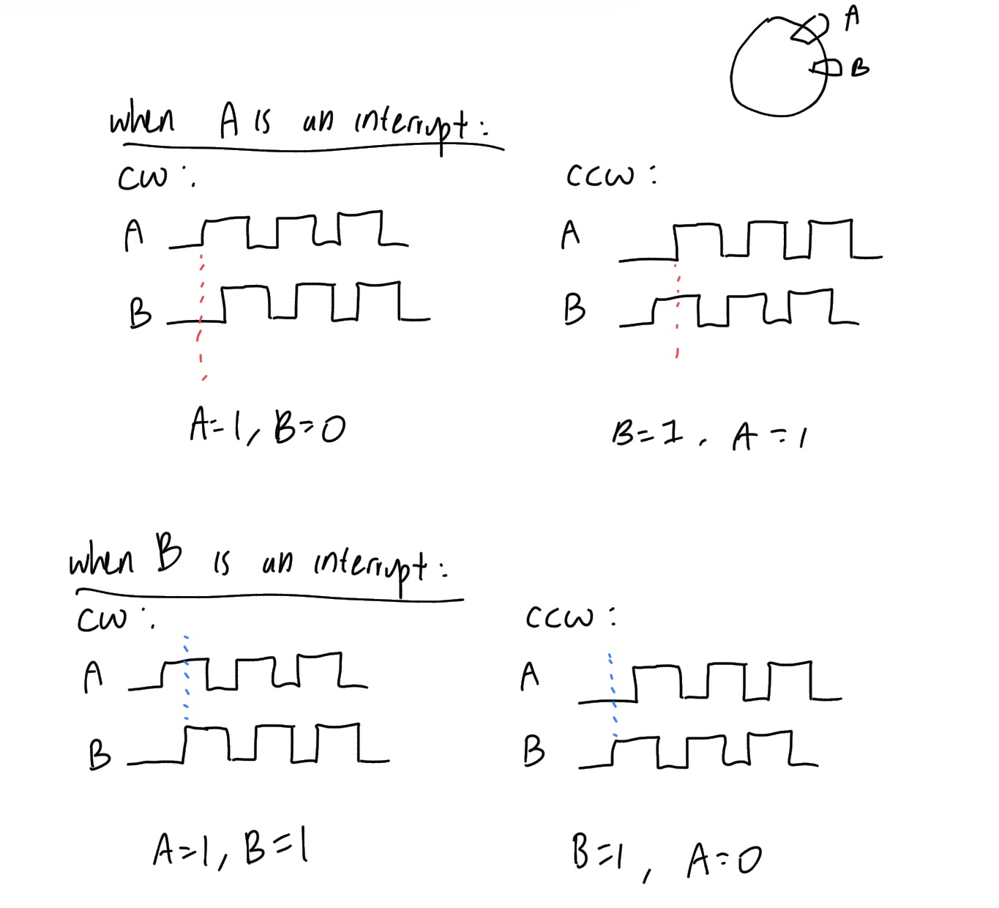
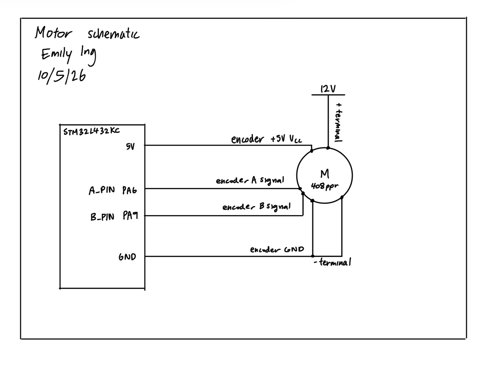
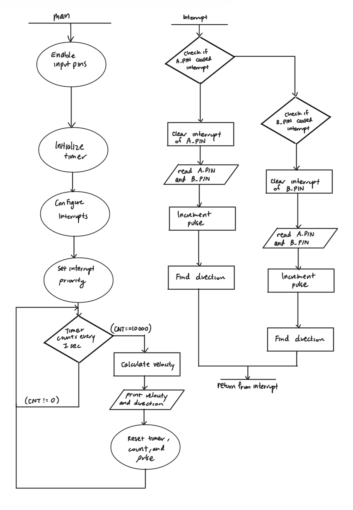

## Lab 5: Interrupts

### Introduction

This lab aims to use an MCU to determine the speed and direction of a motor by reading from a quadrature encoder using interrupts. Timer 2 is used with the interrupts.

### Design and Testing Methodology
A .c and .h file for the timer was created, and set up in a way such that one can call the timer functions easily. A main.h file exists to define pins and other constants. The button_interrupt.c file is the file that handles interrupts and outputs the angular velocity and direction of the motor in the debug terminal. Logic for deciding whether the motor is spinning clockwise or counterclockwise is also implemented in this file.

I aimed for the ARR value of 10,000 so that the timer can count to 1s each time. Since the core clock is of 80 MHz, we simply solve for PSC in the equation 

$$
10000 = \frac{80000000}{PSC+1}
$$

to get PSC = 7999.

#### How raw encoder pulses and their timing are converted into velocity and direction

The encoders A and B were read as interrupts on their rising and falling edges. Due to this design, as a magnet passes through, it is counted four times (on the rising edges and falling edges of A and B). By the time 1s passes, we would record 4 times the number of pulses that passed in this amount of time, even though in reality one pulse passed.

Now, we will find the velocity equation. Since a pulse occurs on each rotation the equation can start as pulse/PPR. However, this is not the final equation. As mentioned before, since the motor has a 408 pulse per rotation and we count 4 times the number of pulses, we would have to multiply 408 by 4 to get the actual number of rotations recorded by our MCU. Therefore, the equation for velocity is
$$
velocity = \frac{pulse}{4*408}
$$

To find the direction the motor is spinning, we can determine cases in which the motor is spinning CCW or CW.

::: {.callout-note collapse="true"}
## Logic for interrupts

Figure 1: Diagram showing the cases when A and B are interrupts, respectively.
:::

Imagine an interrupt as recording the data at the moment in time for the selected signal when it is high.

In Figure 1, we see that when A is an interrupt, we have A = 1, B = 0 for the CW direction, and B = 1, A = 1 for the CCW direction. The logic for this is that when A turns on, we see what the value of B is at that time. This helps us get the logic we need to determine the direction of the motor. This same principle can be applied to the scenario in which B is an interrupt.

#### Testing the Design
I tested the design by hooking the motor up to a DC power supply. I observed the speed the motor produced based on the DC power supply's voltage, and verified that the code was printing out the correct direction of rotation by visually observing the motor's rotation. I made sure to test low, medium, and high voltages to ensure that the speed calculation logic was consistent across all voltages. As expected, the speed increased with higher voltage and decreased with lower voltage.

### Technical Documentation

The source code for this lab can be found in [this GitHub repository](https://github.com/eing523/e155-lab5).

#### Schematic

::: {.callout-note collapse="true"}
## Motor Schematic

Figure 2: Schematic of the physical circuit (motor).
:::

The schematic in [Figure 2](images/schematic.jpeg) shows how the motor circuit is physically connected. Note that switching the wires of the - and + pins will reverse the direction of the motor.

For the STM32L432KC we have encoder A and encoder B's signals connected to PA6 and PA9 respectively, which is the A_PIN and B_PIN on the microcontroller. See the [motherboard schematic](https://hmc-e155.github.io/assets/doc/E155%20FA22%20Development%20Board%20Schematic.pdf) for these pin locations. The 5V pin provides the necessary power to the encoder.

#### Flowchart

::: {.callout-note collapse="true"}
## Flowchart of the main loop and interrupt handlers

Figure 3: Flowchart of the main loop and interrupt handlers.
:::

The flowchart in [Figure 3](images/flowchart.png) shows the flowchart of the main loop and interrupt handlers.

### Results and Discussion

#### Comparing the performance of interrupts to manual polling at high speeds

Interrupts are better than manual polling at high speeds since you will never miss a rising and falling edge. If polling were used instead, the polling intervals could be slightly imprecise, leading to missed edges. Polling doesn't guarantee that we sample at a rising or falling edge either, since we rely on the fact that the encoders are 90 degrees phase shifted. With polling, you could accidentally sample within the region of a signal rather than at the edges, leading to an incorrectly assumed direction.

Additionally, using a motor of 408 PPR and maximum speed of 2.5 rev/s, a minimum polling frequency of 4080 Hz (samples/s) is necessary to accurately capture all pulses. This frequency comes from the equation:
$$
2.5 = \frac{pulse}{4*408}
$$

However, with there being some slight variation in speed or PPR in real life, polling cannot guarantee that the measurement will be as accurate as using interrupts. Also, you would need to change the polling frequency as you change the motor speed in reality, which means that if you keep the same polling frequency of 4080 Hz, it will not capture the edges at other speeds.

In conclusion, using interrupts are better than polling since they guarantee that you will capture all edges, and they are more flexible to changes in speed and PPR.

#### Motor output

When the motor's speed changes, the message on the debug terminal updates accordingly. The same goes for the direction of the motor.

### Conclusion

Using SEGGER and C, I was able to use interrupts and a timer in order to show how the motor's speed and direction changes.

The design meets all the requirements. Overall, the lab was a success!

I spent a total of 10 hours working on this lab.

### AI Prototype Summary

I used Gemini for this exercise. When it ran, it told me that the optimal approach is using the hardware Timer Encoder Interface (TIM1 or TIM 2) rather than manual GPIO interrupts (which is what I did). Since it told me this, I was not able to get the code for the interrupt handlers. When I would request the AI to improve its solution, it would still circle back to the Timer Encoder Interface approach. I tried to implement the Timer Encoder Interface approach and it did not run. I tried to prompt the LLM to debug but it was still unsuccessful after multiple prompts. This exercise taught me that not everything the AI responds with is correct.
